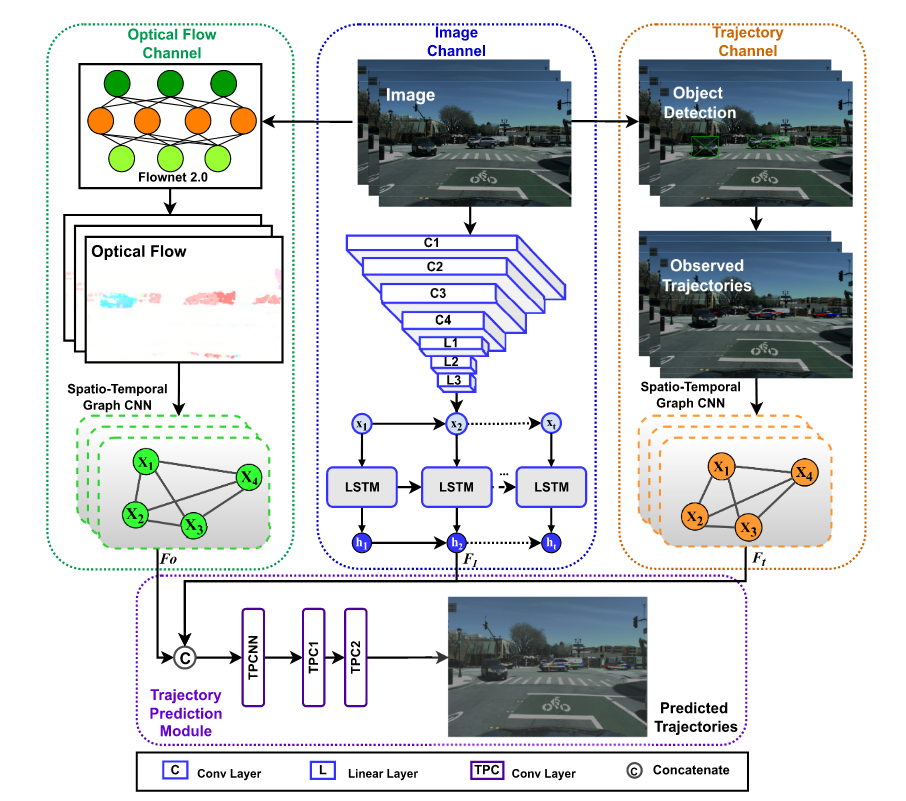

Leveraging Multi-Stream Information Fusion for Trajectory Prediction in Low Illumination Scenarios: A Multi-channel Graph Convolutional Approach
===

### Description
Code for the [paper](https://arxiv.org/abs/2211.10226) *"Leveraging Multi-Stream Information Fusion for Trajectory Prediction in Low Illumination Scenarios: A Multi-channel Graph Convolutional Approach". Hailong Gong, Zirui Li, 
Chao Lu, Guodong Du, Jianwei Gong*.
The paper is submitted to *IEEE Transactions on Intelligent Transportation Systems*.

### MSIF
We propose a novel approach for trajectory prediction in low-illumination scenarios by leveraging multi-stream information fusion, which flexibly integrates image, optical flow, and object trajectory information. The image channel employs Convolutional Neural Network (CNN) and Long Short-term Memory (LSTM) networks to extract temporal information from the camera. The optical flow channel is applied to capture the pattern of relative motion
between adjacent camera frames and modelled by Spatial-Temporal Graph Convolutional Network (ST-GCN), which distinguishes moving objects from background and enhances the image channel in low-illumination scenarios. The trajectory channel is used to recognize high-level interactions between vehicles. Finally,
information from all the three channels is effectively fused in the prediction module to generate future trajectories of surrounding vehicles in low-illumination conditions. The proposed multi-channel graph convolutional approach is validated on HEV-I and newly generated Dark-HEV-I, egocentric vision datasets
that primarily focus on urban intersection scenarios. The results demonstrate that our method outperforms the baselines, in standard and low-illumination scenarios. Additionally, our approach is generic and applicable to scenarios with different types of perception data.


### Framework


### Installation
Meet the minimal requirements of this project.
```
import pytorch
import networkx
import numpy
import tqdm
import matplotlib
```
Or you can just meet the requirements.txt in [Social-STGCNN](https://github.com/abduallahmohamed/Social-STGCNN).    

### Baseline and Dataset
The Baseline of this method is [Social-STGCNN](https://github.com/abduallahmohamed/Social-STGCNN).    
The proposed methods are validated on HEV-I Honda Egocentric View-Intersection ([HEV-I](https://usa.honda-ri.com/hevi)) Dataset.  
The optical flow can be generated using [FLownet2.0](https://github.com/NVIDIA/flownet2-pytorch) or [OpenCV](https://docs.opencv.org/3.4/d4/dee/tutorial_optical_flow.html).

### Citation
If you refer to this work in your research, you are welcome to cite this project.
```
@article{gong2022leveraging,
  title={Leveraging Multi-stream Information Fusion for Trajectory Prediction in Low-illumination Scenarios: A Multi-channel Graph Convolutional Approach},
  author={Gong, Hailong and Li, Zirui and Lu, Chao and Du, Guodong and Gong, Jianwei},
  journal={arXiv preprint arXiv:2211.10226},
  year={2022}
}
```


